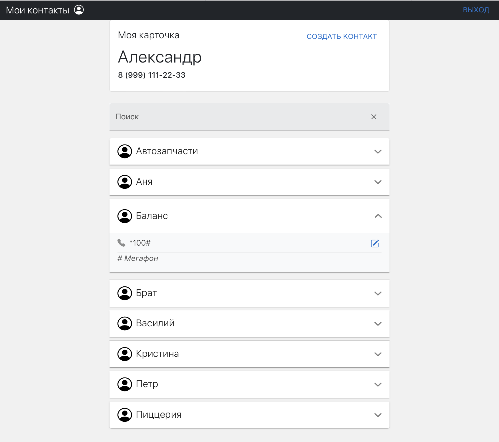

# Личный кабинет "Мои контакты"

Тестовое задание для компании `Takeoff Staff` на вакансию Front-end Developer (React)

## Запуск приложения

**Для запуска приложения необходимо:**

1. Открыть в терминале корневую папку проекта
2. Выполнить команду `npm i`, дождаться установки всех зависимостей
3. В терминале выполнить команду `npm run dev`, дождаться запуска приложения и сервера
4. В браузере открыть страницу http://localhost:3000

В случае неудачи запуска:

1. Удалить из корневой директории приложения папку `node_modules` (если такая имеется)
2. Ввести команду `npm i`, дождаться установки всех зависимостей
3. В терминале выполнить команду `node server.js`
4. Открыть второе окно терминала, перейти в папку приложения
5. Выполнить команду `npm start`
6. В браузере открыть страницу http://localhost:3000

**Вы можете зарегистрировать новый аккаунт или войти в существующий**

_Данные для входа в тестовый аккаунт:_
Телефон: 89991112233
Пароль: 111111

## Preview

